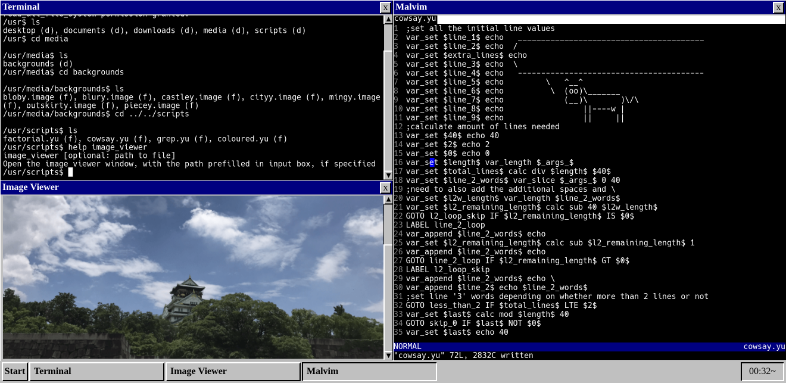
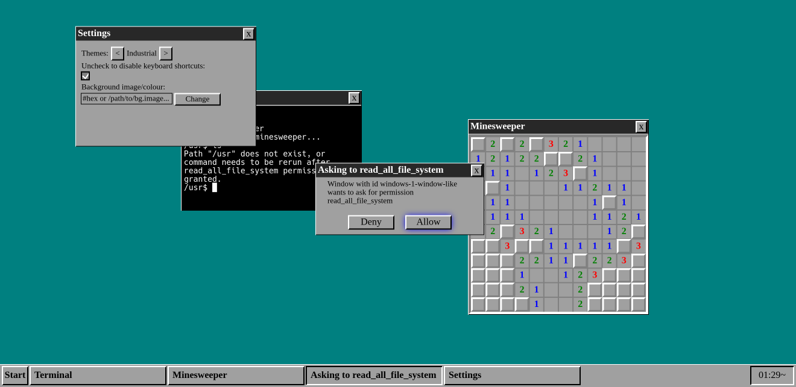
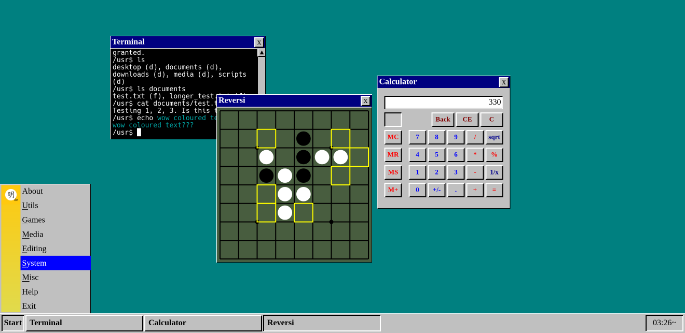

# mingde
A work in progress desktop environment made with HTML Canvas. Kinda like a combination between my engine [Blackbeard](https://github.com/jetstream0/Blackbeard) and [my fake retro OS webpage](https://prussia.dev/retro). Each window is its own canvas. Heavily architecturally inspired by Elm. Other inspirations include Windows 98 and i3.

Licensed under AGPLv3.

## Features
- Terminal with utils and a "scripting language"
- Permission system
- Fully usable with only keyboard (so, so many keyboard shortcuts)
- Games: minesweeper, bag (puzzle game), reversi
- Other apps: calculator, image viewer, vim knockoff
- Works on mobile
- File system
- Exporter: download the mingde filesystem
- Settings: system themes, desktop background changer
- Tiling wm inspired functionality

## Screenshots





## Running

First, clone the repo:

```bash
git clone https://github.com/jetstream0/mingde
cd mingde
```

Then install the dev dependencies (esbuild and typescript):

```bash
cd src
npm install
```

### Running Website

Run the development server:

```bash
npm run dev
```

Alternatively, to build for production:

```bash
npm run build
npm run server
```

The server will run on http://localhost:1381

### Running Desktop App

To run the desktop app, you obviously need Rust installed. It's nice to install `tauri-cli` too:

```bash
cargo install tauri-cli
```

Development mode:

```bash
cargo tauri dev
```

Alternatively, build for release:

```bash
cargo tauri build --release
```

## Documentation
todo

## Some Goals
- [x] Great keyboard-only support (should be usable without a mouse/trackpad, or minimal use of a mouse/trackpad)
- [x] Minimal rerenders (better performance)
- [x] Reasonable amount of customization
- [x] Easily extensible
- [ ] Good documentation
- [x] "Security", or at least windows have limited privileges
- [x] Retro theme
- [x] Cool apps
- [x] More cool apps
- [ ] More more cool apps
- [x] Terminal with cool stuff
- [ ] With tauri, cool integration with the actual OS

Since I used Canvas, a very long term goal could be writing something to translate the Canvas graphics to Vulkan (or something like that), so the DE can actually be ran natively. Probably not though, since I don't have any idea on how to do that.

